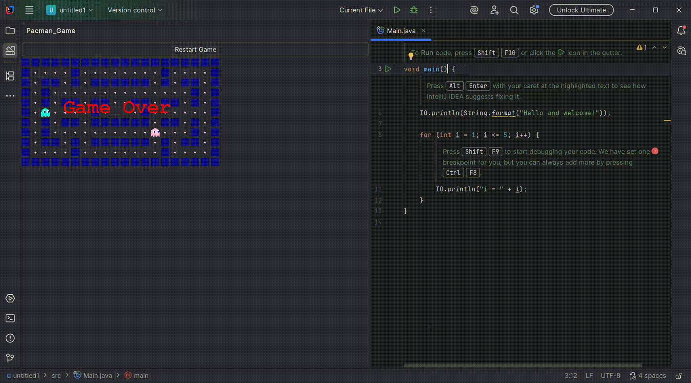

Dzień dobry, z tej strony Zespół 2 IAS. Chcemy przedstawić nasz plugin inspirowany grą PacMan.

Żeby zobaczyć nasze arcydzieło trzeba sklonować repozytorium, w cli zbudować projekt za pomocą polecenia: ./gradlew build (może to potrwać nawet 10 minut).

Jak się powiedzie build wpisujemy polcenie: ./gradlew runIde . Wyświetli nam się okienko gdzie stwórzmy nowy projekt i z lewej strony będzie zakładka Pacman_Game.

Gra polega na tym, żeby unikać niebieskiego i różowego ducha swoją zółtą postacią. Dla zwycięstwa musimy zebrać wszystkie różowe punkciki, jeżeli jakikolwiek duch złapie nas
do tego mementu to przegraliśmy i wyświetla się "Game Over!", żeby ponownie zagrać wystarczy kliknąć Restart Game u góry. Jak wygramy wyświetli się "You Win!".

Nasz plugin w działaniu możemy zobaczyć tutaj:

